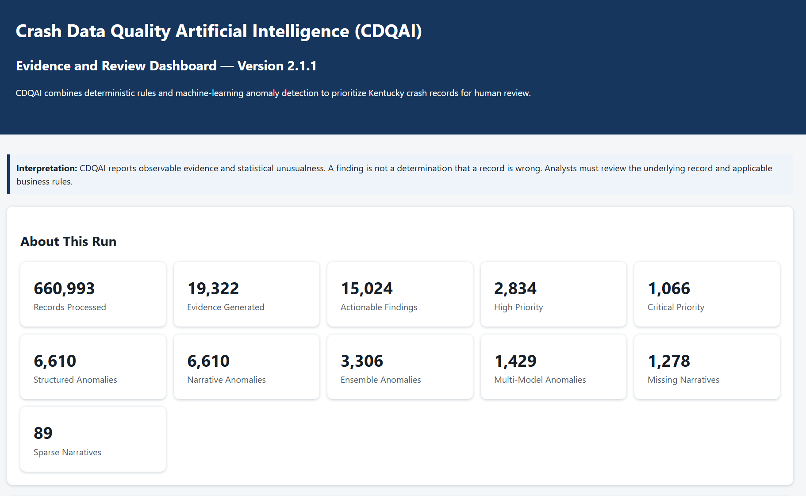

# CDQAI
## Crash Data Quality Artificial Intelligence

> **Explainable Artificial Intelligence for Improving Motor Vehicle Crash Data Quality**

---

## Overview

**Crash Data Quality Artificial Intelligence (CDQAI)** is an explainable artificial intelligence platform developed by the Kentucky Transportation Center to help transportation 
agencies identify, prioritize, and investigate potential data quality issues in large motor vehicle crash databases. By combining deterministic rules, machine learning, and 
natural language processing, CDQAI provides transparent, evidence-based decision support that keeps human analysts in control.

Rather than replacing analysts, CDQAI helps prioritize records that warrant review by combining:

- Deterministic data quality rules
- Machine learning anomaly detection
- Natural language processing of crash narratives
- Explainable evidence generation
- Analyst-oriented prioritization

The goal is to improve the **accuracy, completeness, consistency, and reliability** of crash data while reducing the manual effort required for quality assurance.

Every analytical finding includes supporting evidence, confidence estimates, and a human-readable explanation so analysts can understand why the system flagged a record.

CDQAI is intended for transportation agencies, traffic records personnel, highway safety offices, researchers, and other professionals responsible for maintaining and 
analyzing crash databases.

---

## Dashboard Preview



---

## Quick Start

```bash
git clone https://github.com/paross2/CDQAI.git

cd CDQAI

py -3.11 -m venv .venv

.\.venv\Scripts\Activate.ps1

pip install -e .

Run_CDQAI.bat
```

---

## Why CDQAI?

Crash databases often contain hundreds of thousands of records each year. Traditional quality assurance methods typically rely on manual review, making it difficult to identify subtle inconsistencies or unusual records.

CDQAI provides an intelligent first-pass review that helps analysts focus on the records most likely to contain errors.

Examples include:

- Injury severity inconsistent with narrative text
- Missing or contradictory crash characteristics
- Unusual combinations of roadway, vehicle, and driver attributes
- Suspicious structured data patterns
- Low-quality or incomplete narratives

---

# Guiding Philosophy

## **AI assists analysts.**

CDQAI does **not** automatically change crash records.

Instead, it provides:

- evidence
- confidence
- explanations
- prioritization

allowing trained analysts to make the final determination.

Every finding should be:

- Explainable
- Reproducible
- Transparent
- Defensible

---

# AI Architecture

                Structured Crash Data
                         │
                         ▼
              Isolation Forest Detector
                         │
                         ├──────────────┐
                         │              │
                         ▼              │
                 Narrative Processing   │
                         │              │
                         ▼              │
               Sentence Embeddings      │
                         │              │
                         └──────┬───────┘
                                ▼
                    Deterministic Rules
                                │
                                ▼
                     Finding Synthesis
                                │
                                ▼
                    Analyst Decision Support
                                │
                                ▼
                   Interactive HTML Dashboard

---
# Current Capabilities

| Capability | Status |
|------------|:------:|
| Structured anomaly detection | ✅ |
| Narrative analysis | ✅ |
| Deterministic rules | ✅ |
| Explainable findings | ✅ |
| Interactive dashboard | ✅ |
| Analyst prioritization | ✅ |
| Build metadata | ✅ |
| Automated tests | ✅ |

---
# Key Features

## Explainable AI

Every finding includes:

- Primary Issue
- Confidence
- Evidence Strength
- Analyst Priority
- Supporting Evidence
- Human-readable explanation

---

## Hybrid Detection

CDQAI combines multiple analytical techniques:

- Deterministic validation rules
- Structured anomaly detection
- Narrative text analysis
- Ensemble scoring

---

## Interactive Dashboard

The HTML dashboard provides:

### Executive Summary

Quick overview of analysis results.

### Top Actionable Findings

Prioritized findings requiring analyst attention.

### All Findings Explorer

Interactive exploration including:

- Search
- Primary Issue filter
- Confidence filtering
- Evidence Strength filtering
- Analyst Priority filtering
- Sortable columns
- Expandable evidence

### Documentation

Collapsible sections describing:

- How CDQAI Works
- About CDQAI

### Build Metadata

Displays:

- Version
- Release
- Developers
- Runtime
- Python version
- Installed package versions
- Funding acknowledgement
- Licensing
- AI attribution

---

# Repository Structure

```text
CDQAI/
│
├── cdqai/
│   ├── core/
│   ├── data/
│   ├── detectors/
│   ├── findings/
│   ├── reports/
│   ├── models/
│   ├── utils/
│   └── main.py
│
├── config/
│
├── docs/
│
├── tests/
│
├── AUTHORS.md
├── CHANGELOG.md
├── CITATION.cff
├── INSTALL.txt
├── LICENSE
├── LICENSE-DOCS
├── README.md
├── Run_CDQAI.bat
└── VERSION
```

---
## Technology Stack

- Python 3.11
- pandas
- scikit-learn
- sentence-transformers
- PyTorch
- NumPy
- HTML/CSS/JavaScript
- pytest
---

# Installation

## Requirements

Recommended:

- Python 3.11
- Windows 10 or Windows 11

Clone the repository:

```bash
git clone https://github.com/paross2/CDQAI.git
```

Create a virtual environment:

```bash
py -3.11 -m venv .venv
```

Activate it:

```powershell
.\.venv\Scripts\Activate.ps1
```

Install dependencies:

```bash
pip install -e .
```

---

# Running CDQAI

Run using:

```text
Run_CDQAI.bat
```

or

```bash
python -m cdqai.main
```

---

# Testing

Run the complete automated test suite:

```bash
python -m pytest
```

All tests should pass before submitting code changes.

---

# Development Workflow

CDQAI follows a two-branch workflow.

```
develop
    │
    │ Development
    ▼
Testing
    │
    ▼
Merge
    │
    ▼
main
    │
    ▼
Git Tag
```

### Branches

**develop**

Active development.

**main**

Stable releases only.

### Releases

Each release is identified using an annotated Git tag.

Examples:

```markdown
Examples:

```text
v2.1.1
v2.1.2
v2.2.0

The repository directory remains named:

```
CDQAI
```

Version numbers are maintained through:

- VERSION
- Build metadata
- Git tags

rather than folder names.

---

# Software Engineering Principles

CDQAI emphasizes:

- Explainability
- Transparency
- Reproducibility
- Testability
- Maintainability
- Professional software engineering

Technical debt is minimized whenever practical, and obsolete prototype components are removed as the project matures.

---

# Citation

If CDQAI contributes to published work, please cite:

> Ross, P. Crash Data Quality Artificial Intelligence (CDQAI). Kentucky Transportation Center, University of Kentucky.

See:

```
CITATION.cff
```

for machine-readable citation metadata.

---

# Funding

Development of the Crash Data Quality Artificial Intelligence (CDQAI) software has been supported through **Federal Traffic Safety Information Systems (Section 405(c))** grant funding administered by the **Kentucky Office of Highway Safety (KOHS)** under the **Kentucky Transportation Cabinet (KYTC).**

---

# Disclaimer

The findings, conclusions, software, and recommendations presented herein are those of the authors and do not necessarily represent the official views or policies of:

- Kentucky Transportation Center
- University of Kentucky
- Kentucky Office of Highway Safety
- Kentucky Transportation Cabinet
- United States Department of Transportation

---

# Authors

## Lead Developer

**Paul Ross**

Research Scientist Principal

Kentucky Transportation Center

University of Kentucky

---

## Contributing Developer

**Nathaniel Swallom**

Research Scientist

Kentucky Transportation Center

University of Kentucky

Contributions include:

- Technical research
- Methodology evaluation
- Analytical review
- Software testing and feedback

---

# AI Engineering Assistance

Development of CDQAI was assisted by **OpenAI ChatGPT**.

Human review, software architecture, algorithm selection, validation, testing, and final implementation remain under the direction and responsibility of the lead developer.

---

# License

Software

**MIT License**

Documentation

**Creative Commons Attribution 4.0 International (CC BY 4.0)**

---

# Future Development

### Version 2.1

- Dashboard modernization
- Build metadata
- Explainability improvements
- Interactive findings explorer

### Version 2.2

- Enhanced analytical methods
- Additional finding categories
- Improved visualization
- Performance optimization

### Version 3.0

- Desktop analytics platform
- Multi-agency support
- Expanded reporting
- Enterprise deployment options

---

# Project Status

CDQAI is an actively developed research software platform focused on improving transportation safety data quality through transparent and explainable artificial intelligence.

Contributions, suggestions, and collaboration are welcome.